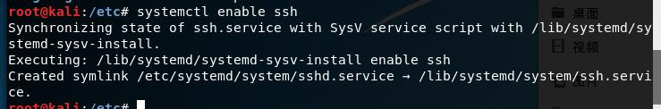
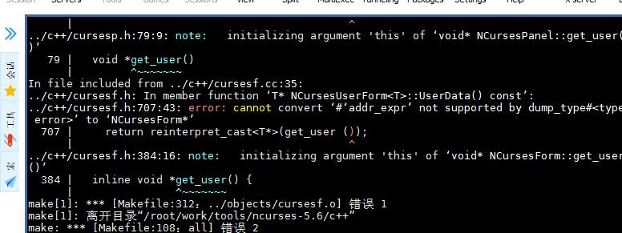

# 嵌入式linux开发 02

## 嵌入式Linux开发环境构建

### 2.1 硬件环境构建

主机与目标板结合的交叉开发模式
对应S3C240开发板，进行嵌入式linux开发时分为3步骤：
（1）在主机上编译Bootloader,然后通过JTAG烧入单板。
（2）在主机上编译嵌入式Linux内核，通过Bootloader烧入单板或直接启动。
（3）在主机上编译各类应用程序，单板启动内核通过NFS运行它们，然后验证后再烧入单板。

#### 2.1.2 硬件要求

主机要求：1、能连接JTAG 2、RS232串口 3、网络 4。至少20G的硬盘
目标单板S3C2440：
1、64MB SDRAM
2、1MB NOR Flash
3、64MB NAND Flash
4、两个网卡（10M和100M）
5、5个串口
6、音频输入输出
7、2.5寸IDE接口
8、标准SD/MMC卡座
9、4个GPIO按键
10、外接I2C接口的实时时钟芯片

### 2.2 软件环境构建

VMware 安装 kali Linux
账号root 密码toor

winodows 安装 MobaXterm_v11.1 

kali linux 配置ssh:
修改 vi /etc/ssh/sshd_config 
找到# Authentication: 
LoginGraceTime 120 
PermitRootLogin without passwd 
StrictModes yes 
改成:
Authentication:
LoginGraceTime 120 
PermitRootLogin yes 
StrictModes yes 
然后重启ssh 服务： service ssh restrat
设置开启启动服务：systemctl  enable ssh

#### 安装开发环境

apt-get install xxxx 安装命令，xxx表示应用名称

安装： 
build-essential ：提供编译程序必须软件包的列表信息，编译程序有了这个安装包就知道头文件在哪，知道库函数在哪，还会下载依赖的软件包，最后组成一个开发环境。
bison ：语法分析器
flex ：词法分析器
manpages-dev  : C函数库的man手册，以后就通过类似“man read"的命令查看函数的用法。

安装交叉编译工具链
1.使用制作好的工具链
cd /work/tools
tar xjf arm-linux-gcc-3.4.5-glibc-2.3.6.tar.bz2
然后在环境变量PATH中增加路径：
export PATH=$PATH:/root/work/tools/gcc-3.4.5-glibc-2.3.6/bin

为了不每次手动设置PATH，可以在/etc/environment中修改PATH值：
PATH="/usr/local/sbin:/usr/local/bin:/usr/sbin:/usr/bin:/sbin:/bin:/root/work/tools/gcc-3.4.5-glibc-2.3.6/bin"

安装ncurses, ncurses是一个能提供功能键自定义（快捷键）、屏幕绘制以及基于文本终端的图形互动功能的动态库。如果没有它，在执行make menuconfig命令配置程序时会出错。
使用以下命令安装：
cd /work/tools/
tar xzf ncurses.tar.gz
cd ncurses-5.6
./configure --with-shard --prefix=/usr
make
make install

编译安装出错：

2.自己制作工具链
使用crosstool
